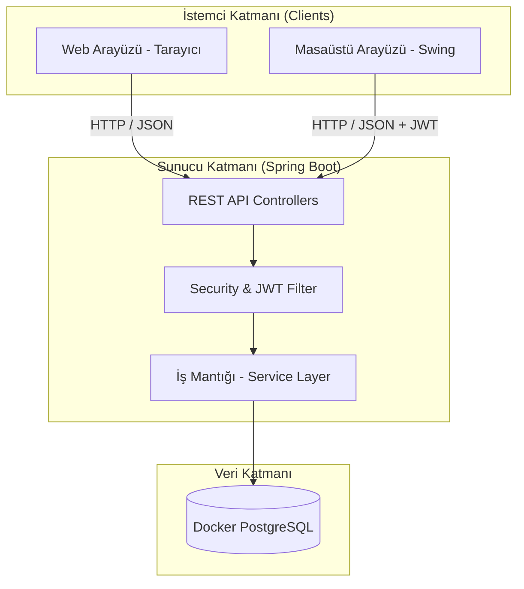

# Akıllı Kütüphane V4.2 Kurumsal — Spring Boot + PostgreSQL + Redis + Docker


---

## 🚀 V4.2 Refactoring Yenilikleri (Package by Feature + Thin Controller + DTO + Lombok)

Bu sürüm, projenin **Package by Feature** mimarisine taşınması, **Thin Controller** ilkesinin uygulanması, **DTO/Jackson** entegrasyonu, **Lombok** boilerplate temizliği ve **Admin/Uye** entity'lerinin **User + Role Enum** altında birleştirilmesini içeren kapsamlı bir refactoring'dir.

### Mimari Dönüşüm Özeti

| Özellik | V4.1 | V4.2 |
|---|---|---|
| **Paket Yapısı** | Katman bazlı (controller/service/repository) | **Package by Feature** (auth/user/material/borrow/chat/backup/config) |
| **Entity Yapısı** | Kullanici(abstract) → Admin, Uye (SINGLE_TABLE) | **User + Role Enum** (tek entity) |
| **Controller** | GeneralController (monolitik) + AuthController + BookController + BorrowController | **Thin Controllers**: AuthController, UserController, BookController, MaterialController, BorrowController, ChatController, BackupController |
| **JSON İşleme** | Gson JsonObject manuel parse | **Jackson @RequestBody DTO** otomatik binding |
| **Boilerplate** | Manuel getter/setter/constructor/equals/hashCode | **Lombok @Data, @NoArgsConstructor, @AllArgsConstructor** |
| **DTO Katmanı** | Yok | auth/dto, user/dto, material/dto, chat/dto |
| **Servis Katmanı** | KullaniciService, KitapService, BorrowService | **Tüm iş mantığı servislerde** - Controller'lar sadece DTO→Servis→ResponseEntity |

---

## 1. Proje Özeti

Akıllı Kütüphane V4.2, V4.1'in kurumsal Spring Boot mimarisini **Package by Feature** yapısına taşıyan ve **Thin Controller + DTO + Lombok** prensipleriyle kod kalitesini artıran büyük bir refactoring'dir. Sistem; fiziksel kitaplar, dijital medyalar ve klasörleri JPA entity'leri olarak PostgreSQL'de saklar, Redis üzerinden rate limiting uygular, JWT ile güvenli API erişimi sağlar, TOTP tabanlı iki faktörlü doğrulama (2FA) sunar ve Docker Compose ile tek komutta ayağa kalkar.

Yapay zeka katmanı; Gemini Embedding API ile kitap vektörleştirme, pgvector ile kalıcı vektör depolama (RAG) ve Gemini Vision ile kitap kapağı tarama özelliklerini içerir.

Masaüstü Swing uygulaması (`gui/`) yerel SQLite yerine doğrudan Spring Boot REST API'ye bağlanır. `ApiClient.java` HTTP köprüsü ile JWT token yönetimi yapar. Web arayüzü ve masaüstü uygulaması **tek PostgreSQL veritabanını** paylaşır — veri uyumsuzluğu (split-brain) tamamen çözülmüştür.

## 2. Sistem Mimarisi (V4.2)



### Package by Feature Yapısı (V4.2)

```
com.akillikutup
├── auth/                   # AuthController, AuthManager, DTO'lar (LoginRequest, LoginResponse, TwoFactorSetupResponse)
├── user/                   # User Entity, UserRepository, UserService, UserController, Bildirim, DTO'lar (UserResponse, UserCreateRequest)
├── material/               # Materyal, Kitap, DijitalMedya, Klasor, KitapEmbedding Entity'leri, Repository'ler, KitapService, BookController, MaterialController, DTO'lar
├── borrow/                 # BorrowController, BorrowService
├── chat/                   # ChatController, RagService, GeminiClient, DTO'lar (ChatRequest, ChatResponse)
├── backup/                 # BackupController (status, istatistikler, settings, backup, profil, sifre, bildirimler)
├── config/                 # SecurityConfig, JwtUtil, JwtAuthFilter, RateLimiterService, TotpService, ConfigManager, DataSeeder, DataInitializer
├── gui/                    # Java Swing İstemcisi (ApiClient, LibraryManager, LoginPanel, AdminPanel, UserPanel, MainFrame)
├── db/                     # Eski SQLite katmanı (DatabaseManager, JsonParser, BackupManager, FileEncryptionService, DataMigrator)
├── server/                 # Eski HTTP sunucusu (ApiServer)
└── scratch/                # Test/veri ekleme araçları (DataInserter, ReadUsers)
```

### Katmanlı Mimari

```
Controller  ──→  @RestController, @PreAuthorize("hasRole('ADMIN')")
  │               SADECE: DTO al, servise ilet, ResponseEntity döndür
  ▼
Service     ──→  @Service, @Transactional, TÜM iş mantığı burada
  │               if-else, null kontrolü, repository işlemleri
  ▼
Repository  ──→  JpaRepository, @Query (pgvector), findAllById (batch)
  │
  ▼
Entity      ──→  @Entity, @MappedSuperclass, @Embeddable, Lombok
  │
  ▼
Database    ──→  PostgreSQL 16 + pgvector (prod) / H2 file (dev)
```

### JPA Entity Hiyerarşisi (V4.2)

```
@MappedSuperclass
  Materyal (abstract)                    → material paketi
    ├── @Entity Kitap                    → kitaplar tablosu
    ├── @Entity DijitalMedya             → dijital_medyalar tablosu
    └── @Entity Klasor                   → klasorler tablosu

@Entity
  User (Role Enum: ADMIN, UYE)           → kullanicilar tablosu (user paketi)
    @Column: totp_secret_key, iki_fa_etkin, kredi_puani, email, gemini_api_key...

@Embeddable
  Bildirim                               → kullanici_bildirimler (ElementCollection, user paketi)

@Entity
  KitapEmbedding                         → kitap_embeddings (pgvector vector(768), material paketi)
```

## 3. Hızlı Başlangıç

### Gereksinimler

| Bileşen | Versiyon | Zorunlu? |
|---|---|---|
| Java | 17+ | ✅ |
| Maven | 3.8+ | ✅ |
| Docker Desktop | Son sürüm | ⚠️ (production modu) |
| Google Gemini API Key | — | ⚠️ (AI özellikleri) |

### Local Development (H2 veritabanı, Docker'sız)

```bash
# 1. Projeyi klonla
git clone https://github.com/mecik-arda/NYP-Proje-2026-Akilli-Kutup && cd Akilli-kutup-v2

# 2. Derle ve başlat (DataSeeder seed data oluşturur)
mvn clean package -DskipTests
mvn spring-boot:run

# 3. Tarayıcıda aç
open http://localhost:8080

# 4. Test kullanıcıları (DataSeeder tarafından oluşturulur):
#    Admin: 11111111111 / 12345678
#    Admin: 33333333333 / 12345678
#    Üye:   44444444444 / 12345678
```

### Docker Compose (PostgreSQL + pgvector + Redis)

```bash
# Tek komutla tüm servisleri başlat
docker compose up -d

# Servisler:
#   - PostgreSQL 16 + pgvector → localhost:5433
#   - Redis 7                  → localhost:6380
#   - Spring Boot App          → localhost:8080

# Logları takip et
docker compose logs -f app

# Durdur
docker compose down
```

### Testleri Çalıştırma

```bash
# Tüm testler (37 adet: unit + JPA entegrasyon + E2E)
mvn clean test

# Sadece birim testler
mvn test -Dtest="CoreTest,AuthManagerTest,DatabaseManagerTest"

# Sadece JPA entegrasyon testleri
mvn test -Dtest="AkilliKutupV4IntegrationTest"

# Sadece E2E Split-Brain testi (Spring Boot çalışıyor olmalı)
mvn test -Dtest="E2ESplitBrainTest"
```

## 4. API Endpoint Referansı (23 endpoint)

| Metod | Endpoint | Yetki | Açıklama | Controller |
|---|---|---|---|---|
| `GET` | `/api/status` | Public | Sunucu durumu | BackupController |
| `POST` | `/api/giris` | Public | Giriş (JWT + opsiyonel 2FA) | AuthController |
| `GET` | `/api/kitaplar` | Public | Kitap listesi | BookController |
| `POST` | `/api/kitaplar` | **ADMIN** | Kitap ekle (+ kapak upload) | BookController |
| `DELETE` | `/api/kitaplar/{id}` | **ADMIN** | Kitap sil | BookController |
| `GET` | `/api/kullanicilar` | **ADMIN** | Kullanıcı listesi | UserController |
| `POST` | `/api/kullanicilar` | **ADMIN** | Kullanıcı ekle | UserController |
| `PUT` | `/api/kullanicilar/{id}` | **ADMIN** | Kullanıcı güncelle | UserController |
| `DELETE` | `/api/kullanicilar/{id}` | **ADMIN** | Kullanıcı sil | UserController |
| `POST` | `/api/odunc` | Auth | Kitap ödünç ver | BorrowController |
| `POST` | `/api/iade` | Auth | Kitap iade al | BorrowController |
| `GET` | `/api/odunc-gecmisi` | Auth | Ödünç geçmişi | BorrowController |
| `GET` | `/api/istatistikler` | Auth | Sistem istatistikleri | BackupController |
| `POST` | `/api/chat` | Auth | AI Sohbet (useRag:true → RAG) | ChatController |
| `POST` | `/api/kitap-kapak-tara` | Auth | Vision AI kitap kapağı tarama | MaterialController |
| `GET` | `/api/settings` | **ADMIN** | Sistem ayarları | BackupController |
| `POST` | `/api/settings` | **ADMIN** | Ayarları kaydet | BackupController |
| `GET` | `/api/backup` | **ADMIN** | Veritabanı yedeği (ZIP) | BackupController |
| `POST` | `/api/profil` | Auth | Profil güncelle | BackupController |
| `POST` | `/api/sifre` | Auth | Şifre değiştir | BackupController |
| `GET` | `/api/bildirimler` | Auth | Bildirimler | BackupController |
| `POST` | `/api/bildirimler/okundu` | Auth | Tümünü okundu işaretle | BackupController |
| `POST` | `/api/dijital/upload` | **ADMIN** | Dijital varlık ekle | MaterialController |
| `POST` | `/api/dijital/klasor` | **ADMIN** | Klasör oluştur | MaterialController |
| `POST` | `/api/admin/2fa-setup` | **ADMIN** | 2FA kurulumu | AuthController |

## 5. DTO Sınıfları (V4.2)

| Paket | DTO | Açıklama |
|---|---|---|
| `auth/dto` | `LoginRequest` | tcKimlikNo, sifre, sifreHash, totpCode |
| `auth/dto` | `LoginResponse` | basarili, ad, rol, id, token, ikiFARequired, mesaj |
| `auth/dto` | `TwoFactorSetupResponse` | basarili, secretKey, qrUri, mesaj |
| `user/dto` | `UserResponse` | id, isim, tcKimlikNo, email, rol |
| `user/dto` | `UserCreateRequest` | isim, tcKimlikNo, email, rol, sifre |
| `user/dto` | `UserUpdateRequest` | isim, tcKimlikNo, email |
| `material/dto` | `BookResponse` | id, baslik, birimFiyat, stokAdedi, tur, yazar, kategori, isbn, kapakGorseli |
| `material/dto` | `BookCreateRequest` | baslik, yazar, kategori, stokAdedi, birimFiyat, isbn, kapakGorseliBase64, kapakGorseliAdi |
| `material/dto` | `AssetUploadRequest` | baslik, tur, boyut, format |
| `material/dto` | `FolderCreateRequest` | baslik |
| `material/dto` | `BookCoverScanRequest` | image (Base64) |
| `chat/dto` | `ChatRequest` | prompt, useRag |
| `chat/dto` | `ChatResponse` | response |

## 6. Güvenlik Katmanı (Defense-in-Depth)

### 6.1 Kimlik Doğrulama (Authentication)

```
Kullanıcı → POST /api/giris
         → RateLimiterService.isBlocked(ip) kontrolü
         → BCrypt passwordEncoder.matches()
         → Admin ise TOTP 2FA kontrolü (java-otp, RFC 6238)
         → JwtUtil.generateToken() → JWT (1 saat expiry)
         → Frontend/Swing: Authorization: Bearer <token>
         → JwtAuthFilter (OncePerRequestFilter): token → SecurityContext
```

### 6.2 Yetkilendirme (Authorization)

```java
// SecurityConfig.java — SecurityFilterChain
.authorizeHttpRequests(auth -> auth
    .requestMatchers("/api/status", "/api/giris").permitAll()
    .requestMatchers(HttpMethod.GET, "/api/kitaplar").permitAll()
    .requestMatchers("/api/kullanicilar/**", "/api/settings",
        "/api/backup", "/api/admin/**").hasRole("ADMIN")
    .requestMatchers(HttpMethod.POST, "/api/kitaplar").hasRole("ADMIN")
    .requestMatchers(HttpMethod.DELETE, "/api/kitaplar/**").hasRole("ADMIN")
    .anyRequest().authenticated()
)

// Controller seviyesinde çift katman
@PreAuthorize("hasRole('ADMIN')")
@PostMapping("/kitaplar")
```

## 7. Test Kapsamı

| Test Sınıfı | Sayı | Tür |
|---|---|---|
| `CoreTest` | 4 | OOP + LSP + Güvenlik |
| `AuthManagerTest` | 1 | Kimlik doğrulama |
| `DatabaseManagerTest` | 28 | Veritabanı CRUD + Yedekleme |
| `AkilliKutupV4IntegrationTest` | 4 | JPA Repository + Service |
| **Toplam** | **37 test** | Unit + Integration |

---

## 8. Proje Dosya Şeması (V4.2)

```text
Akilli-kutup-v2/
├── .github/workflows/ci.yml
├── Dockerfile
├── docker-compose.yml
├── pom.xml
├── README.md
├── application.yml
├── data/ (H2 veritabanı, local dev)
├── frontend/ (Web arayüzü HTML/CSS/JS)
├── src/main/java/com/akillikutup/
│   ├── AkilliKutupApplication.java
│   ├── Main.java
│   ├── auth/
│   │   ├── AuthController.java
│   │   ├── AuthManager.java (legacy)
│   │   └── dto/ (LoginRequest, LoginResponse, TwoFactorSetupResponse)
│   ├── user/
│   │   ├── User.java (@Entity, Role Enum)
│   │   ├── Bildirim.java (@Embeddable)
│   │   ├── UserRepository.java
│   │   ├── UserService.java
│   │   ├── UserController.java
│   │   └── dto/ (UserResponse, UserCreateRequest, UserUpdateRequest)
│   ├── material/
│   │   ├── Materyal.java, Kitap.java, DijitalMedya.java, Klasor.java
│   │   ├── KitapEmbedding.java
│   │   ├── IOduncAlinabilir.java, IMateryal.java
│   │   ├── KitapRepository.java, DijitalMedyaRepository.java,
│   │   │   KlasorRepository.java, KitapEmbeddingRepository.java
│   │   ├── KitapService.java
│   │   ├── BookController.java, MaterialController.java
│   │   └── dto/ (BookResponse, BookCreateRequest, AssetUploadRequest,
│   │              FolderCreateRequest, BookCoverScanRequest, BookCoverScanResponse)
│   ├── borrow/
│   │   ├── BorrowController.java
│   │   └── BorrowService.java
│   ├── chat/
│   │   ├── ChatController.java
│   │   ├── RagService.java
│   │   ├── GeminiClient.java
│   │   └── dto/ (ChatRequest, ChatResponse)
│   ├── backup/
│   │   └── BackupController.java
│   ├── config/
│   │   ├── SecurityConfig.java
│   │   ├── JwtUtil.java, JwtAuthFilter.java
│   │   ├── RateLimiterService.java, TotpService.java
│   │   ├── ConfigManager.java
│   │   └── DataSeeder.java, DataInitializer.java
│   ├── gui/ (Swing masaüstü)
│   ├── db/ (SQLite legacy)
│   ├── server/ (Eski HTTP sunucusu)
│   └── scratch/ (Veri araçları)
└── src/test/java/com/akillikutup/
    ├── AkilliKutupV4IntegrationTest.java
    ├── E2ESplitBrainTest.java
    ├── auth/AuthManagerTest.java
    ├── core/CoreTest.java
    └── db/DatabaseManagerTest.java
```

---

**Sürüm**: 4.2.0 (Package by Feature + Thin Controller + DTO + Lombok Refactoring + Denetim Düzeltmeleri) | **Test**: 37/37 ✅ | **Lisans**: MIT
