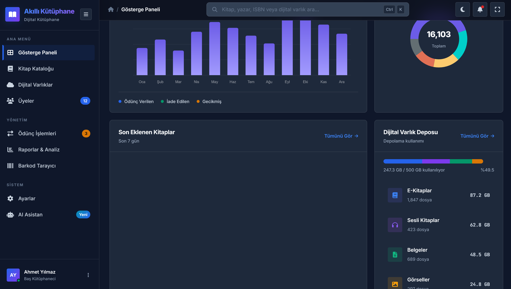
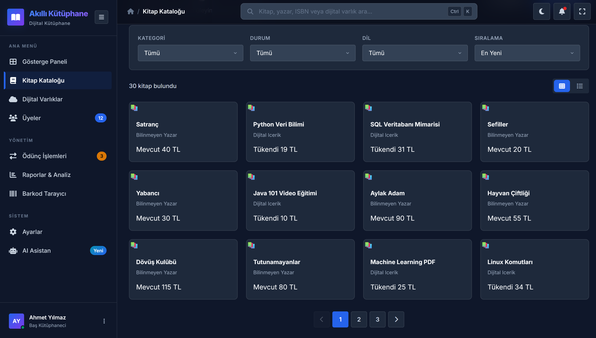
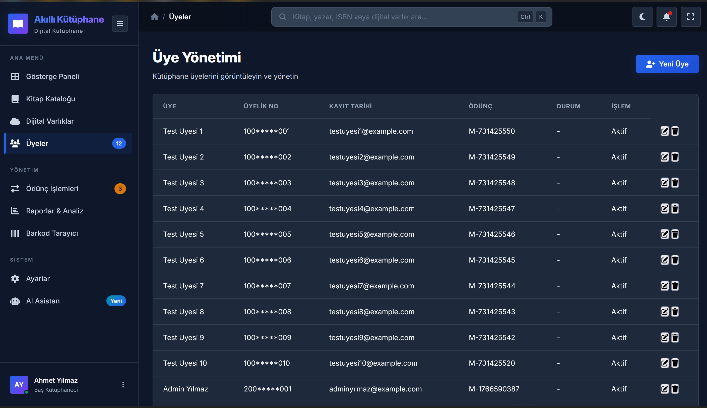
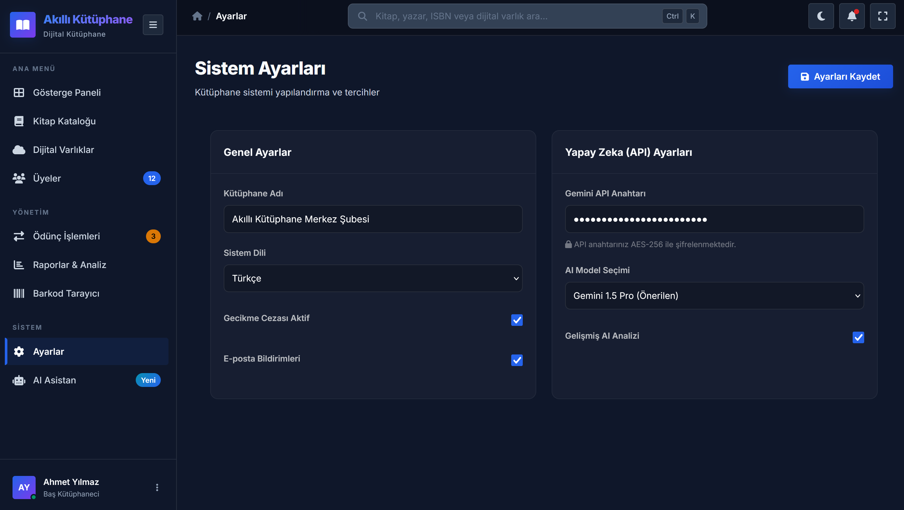
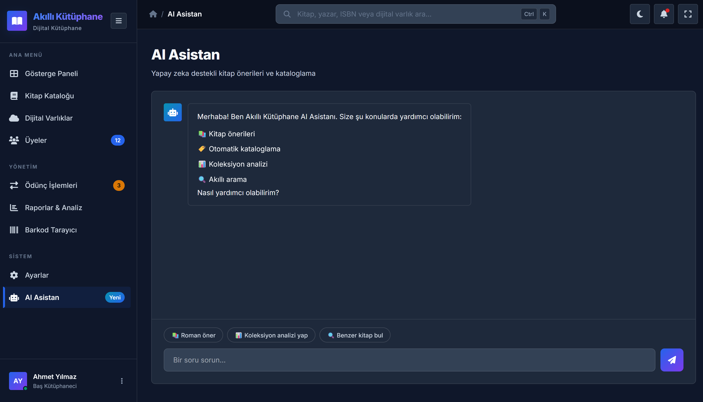
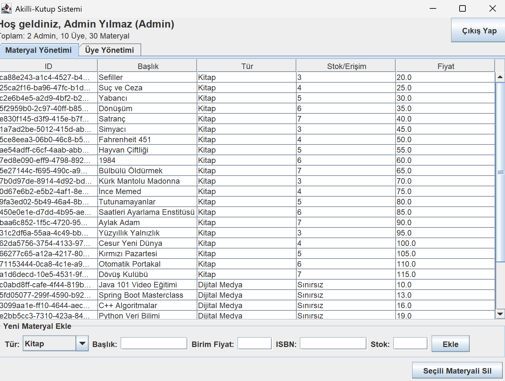

# Akıllı Kütüphane ve Güvenli Dijital Varlık Yönetim Sistemi V2 - 2026 Nesneye Yönelik Programlama Proje Ödevi


### Uygulama Ekran Görüntüleri

<p align="center">
  
  
</p>
<p align="center">
  
  
</p>
<p align="center">
  
  
</p>

---

## 1. Proje Özeti
Bu proje, geleneksel kütüphane otomasyonlarını modern web teknolojileri, Yapay Zeka (AI) ve derinlemesine savunma (Defense-in-Depth) prensipleriyle birleştiren, Java tabanlı bir dijital varlık yönetim sistemidir. Sistem; fiziksel kitaplar, dijital medyalar ve süreli yayınlar gibi farklı materyalleri Nesneye Yönelik Programlama (OOP) standartlarıyla tek bir merkezden yönetir. Klasik ödev projelerinden farklı olarak, Java bir web sunucusu (Backend) gibi konumlandırılmış ve istemci (Frontend) ile haberleşmesi güvenli bir REST mimarisi üzerine inşa edilmiştir. V2 sürümü ile birlikte Google Gemini 1.5 altyapısı entegre edilerek yapay zeka destekli akıllı asistan yetenekleri kazandırılmıştır.

## 2. Çekirdek Mimari ve OOP Uygulamaları
Projenin temel iskeleti, yazılım mühendisliği standartlarına uygun olarak tasarlanmıştır:
*   Kalıtım (Inheritance) ve Soyutlama (Abstraction): IMateryal arayüzü ve Materyal soyut sınıfı üzerinden Kitap ve DijitalMedya gibi alt sınıflar türetilerek, genişletilebilir (Scalable) bir yapı kurulmuştur.
*   Çok Biçimlilik (Polymorphism): Her materyal türünün ceza hesaplama veya ödünç verilme mantığı çalışma zamanında (Runtime) dinamik olarak belirlenir.
*   Kapsülleme (Encapsulation): Kritik iş mantığı, ceza puanları ve sistemin iç durumu dış müdahalelere kapatılarak nesne bütünlüğü korunmuştur.
*   Tek Sorumluluk Prensibi (Single Responsibility Principle - SRP): Devasa DatabaseManager sınıfı parçalanarak sorumluluklar; yüksek performanslı JSON dönüşümü için JsonParser'a, zamanlanmış yedeklemeler ve otomatik temizlik için BackupManager'a, şifreleme ve anahtar yönetimi için FileEncryptionService sınıfına devredilmiştir.

## 3. Siber Güvenlik Katmanı (Cybersecurity Framework)
Proje, kullanıcı verilerini ve sunucu bütünlüğünü korumak amacıyla gelişmiş güvenlik mekanizmaları içerir:
*   Kriptografik Şifreleme (Hashing & Salting): Kullanıcı parolaları veritabanında kesinlikle açık metin (plaintext) olarak saklanmaz. Parolalar, güvenlik standartlarına uygun olarak hash algoritmaları (SHA-256) kullanılarak şifrelenir. Ayrıca hassas konfigürasyon verileri AES-256 algoritmasıyla uçtan uca korunur.
*   Kimlik Doğrulama ve Yetkilendirme (Auth & Authorization): Frontend ile Backend arasındaki API iletişiminde yetkisiz erişimleri engellemek için güvenlik mekanizmaları devrededir. Sistemde En Az Ayrıcalık (Least Privilege) prensibi uygulanır; sıradan bir Uye sadece okuma yapabilirken, CRUD operasyonlarını yalnızca Admin yetkisine sahip kullanıcılar gerçekleştirebilir.
*   Girdi Denetimi ve Sanitizasyon (Input Validation): İstemciden (Web arayüzünden) gelen her türlü veri, Backend tarafında işlenmeden önce süzgeçten geçirilir. Bu sayede JSON Injection ve XSS gibi saldırı vektörleri engellenir.
*   Dosya Yolu Güvenliği (Path Traversal Protection): Sistem, yerel JSON dosyalarını kullandığından dışarıdan manipüle edilmiş dosya yolu isteklerine karşı sıkı bir dizin denetimi uygular. ApiServer statik dosya sunucusu, `getCanonicalPath()` kontrolü sayesinde isteklerin `frontend` klasörü dışına çıkmasını engeller.
*   Gizli Anahtar Güvenliği (Key Management): Kaynak koda gömülü olan statik AES anahtarı kaldırılmış, bunun yerine otomatik oluşturulan ve güvenli bir şekilde saklanan `data/secret.key` yapısına geçilmiştir.
*   Güvenli Şifre Kıyaslaması: AuthManager tarafında hash kıyaslamalarında platformlar arası byte dönüşüm hatalarını ve olası sızıntıları önlemek için UTF-8 standartları zorunlu kılınmıştır.

## 4. Veri Kalıcılığı ve Hata Yönetimi (Database & Persistence)
*   Sistem, SQL kullanmak yerine kendi özel Dosya Tabanlı Veritabanı Motorunu (File-Based Database Engine) Java ile sıfırdan yönetir.
*   Veriler JSON formatında serialize/deserialize edilerek saklanır.
*   Gelişmiş Hata Yakalama (Exception Handling) blokları sayesinde; dosya bulunamaması veya JSON formatının bozulması gibi durumlarda sistem çökmez. Ayrıca her kritik işlemden önce zaman damgalı otomatik JSON yedekleri oluşturularak veri kaybı tamamen önlenir.

## 5. Modern Web Arayüzü ve AI Entegrasyonu (Frontend Integration)
*   Java backend'i, gömülü bir HTTP sunucusu modülü (ApiServer) barındırarak ağ üzerinden gelen istekleri dinler.
*   Kullanıcılar sisteme kurumsal tasarıma sahip, karanlık tema destekli, asenkron (Fetch API) ve kullanıcı dostu bir web paneli üzerinden erişim sağlar.
*   Sisteme entegre edilen GeminiClient modülü sayesinde kullanıcılara okuma geçmişlerine uygun materyal önerileri, akıllı asistan hizmetleri ve katalog analizleri sağlanır.

## 6. Sistemin Temel Özellikleri (Features)

Projeye V2 sürümü ile birlikte kazandırılan ve sistemin temelini oluşturan tüm fonksiyonel yetenekler aşağıda detaylandırılmıştır:

*   Kapsamlı Materyal Yönetimi: Admin kullanıcıları sisteme Kitap veya Dijital Medya gibi farklı özelliklere sahip materyaller ekleyebilir, güncelleyebilir, stok durumlarını kontrol edebilir ve silebilir.
*   Rol Tabanlı Gelişmiş Kimlik Doğrulama: Admin ve standart Üye rolleri birbirinden ayrılmıştır. SHA-256 ile şifrelenen hesaplara giriş yapıldığında, yetkilendirmeye göre sadece ilgili butonlar ve işlemler (CRUD) açılır.
*   Ödünç Alma ve İade Süreçleri: Kullanıcılar kütüphane materyallerini ödünç alabilir. Ödünç alma limitleri (Admin için sınırsız, Üye için belirli limitler) nesneye yönelik programlama kurallarıyla dinamik olarak yönetilir.
*   Dinamik Ceza Puanı ve Kredi Sistemi: Zamanında iade edilmeyen materyaller için sisteme entegre algoritma sayesinde dinamik ceza puanı hesaplanır. Kredisi eksilere düşen üyeler otomatik olarak kısıtlanır.
*   Google Gemini Yapay Zeka Desteği: Sisteme AES-256 ile şifrelenerek entegre edilen Gemini 3.5 Flash altyapısı sayesinde; kullanıcılara akıllı kitap/medya önerileri yapılır ve genel okuma alışkanlıkları analiz edilir.
*   Finansal Analiz ve Otomatik PDF Raporlama: Sistemin finansal durumu, kesilen cezalar ve genel istatistikler admin paneli üzerinden anlık olarak PDF formatında (veya ekranda tablo olarak) raporlanabilir.
*   Simüle Edilmiş Barkod/Hızlı Tarama Sistemi: Ön yüz (Dashboard) üzerinde yer alan hızlı işlemler menüsü ile kütüphane barkod sistemi simüle edilerek tek tıkla en çok okunanlara erişim imkanı tanınır.
*   Dinamik Bildirimler ve Gerçek Zamanlı Profil Senkronizasyonu: Kullanıcıların web paneli üzerinden anlık profil güncellemeleri ve bildirim yönetimi yapabilmesi sağlanmıştır. Bu güncellemeler eşzamanlı olarak Java Desktop GUI ile de senkronize edilir.
*   Asenkron Çalışan Arka Plan Sunucusu: Java tabanlı ApiServer sayesinde tüm arayüz (Frontend) işlemleri sayfayı yenilemeden arka planda hızlı ve güvenli bir şekilde sunucu ile haberleşir.
*   Gelişmiş AI Hata Yönetimi ve Model Fallback: Google Gemini API tarafındaki aşırı yüklenmeler (503 High Demand) ve hatalara karşı otomatik yedek (fallback) modeller (`gemini-1.5-pro-latest`, `gemini-pro`) denenir. Ayrıca çapraz alan (CORS) sorunları Native Java HTTP sunucusunda çözülmüştür.
*   Felaket Kurtarma ve Otomatik Yedekleme: Sistemde yapılan her kritik okuma/yazma işlemi öncesinde `DatabaseManager` modülü tüm veritabanı (JSON) dosyalarının tam yedeğini alır.

## EKİP GÖREV DAĞILIMI

Backend & Core Architect - Ahmet Güler:

Projenin nesneye yönelik tasarım hiyerarşisini ve iş mantığını kurgular. Sistemdeki tüm nesnelerin atası olan Abstract sınıfları ve ortak davranışları belirleyen Interface yapılarını tasarlar. Kalıtım mekanizması ile materyal çeşitliliğini yönetirken; kredi puanı hesaplama, dinamik ceza sistemi ve stok kontrolü gibi çekirdek algoritmaları kodlar. Ayrıca, sınıflar arası ilişkilerin sağlam bir mimaride yürümesini sağlayarak projenin genişletilebilir olmasını garanti altına alır.

Yaptığı dosyalar:

```text
src/main/java/com/akillikutup/core/IMateryal.java
src/main/java/com/akillikutup/core/Materyal.java
src/main/java/com/akillikutup/core/Kitap.java
src/main/java/com/akillikutup/core/DijitalMedya.java
src/test/java/com/akillikutup/core/CoreTest.java
src/main/java/com/akillikutup/Main.java
```

Database & Data Persistence Manager / Penetration Tester - Arda Meçik:

Sistemin veri kalıcılığı katmanını tasarlar ve yönetir. Verileri SQL yerine Java kullanarak dosya tabanlı bir yapıda saklayacak olan Database Engine mekanizmasını kurar. Nesnelerin diske yazılması ve açılışta tekrar belleğe yüklenmesi süreçlerini yürütür. Ayrıca, dosya okuma/yazma sırasında oluşabilecek tüm senaryolar için Hata Yönetimi mimarisini, otomatik yedekleme süreçlerini kurar. Projenin canlıya alınma durumunda host penetrasyon işlemini yapar.

Yaptığı dosyalar:

```text
src/main/java/com/akillikutup/db/DatabaseManager.java
src/main/java/com/akillikutup/db/BackupManager.java
src/main/java/com/akillikutup/db/JsonParser.java
src/main/java/com/akillikutup/db/FileEncryptionService.java
src/test/java/com/akillikutup/db/DatabaseManagerTest.java
data/users.json
data/materials.json
data/backup/
data/secret.key
```

UI/UX Developer - Göktuğ Berke Kuzucu:

Sistemin kullanıcı ile temas eden tüm görsel arayüzlerini ve etkileşim senaryolarını tasarlar. Web teknolojilerini kullanarak karmaşık kütüphane işlemlerini son kullanıcı için basit bir deneyime dönüştürür. Kurumsal koyu tema, görsel hiyerarşi, renk paleti ve tipografi seçimleriyle kullanıcı deneyimini iyileştirirken; Backend'den gelen verileri dinamik grafikler, tablolar ve uyarı pencereleriyle görselleştirir.

Yaptığı dosyalar:

```text
frontend/index.html
frontend/dashboard.html
frontend/css/login.css
frontend/css/main.css
frontend/js/dashboard.js
```

Security & Integration Specialist - Eren Gider:

Sistemin güvenlik altyapısını ve iletişim ağını kurar. AES-256 ve SHA-256 şifreleme sistemleri üzerinden güvenli veri ve konfigürasyon depolama mimarilerini kurar. ApiServer ile Java backend - web frontend haberleşmesini sağlar. V2 güncellemesi ile Gemini AI entegrasyonunu gerçekleştirerek sisteme yapay zeka özelliklerini kazandırır. Kapsamlı README dokümantasyonunu yönetir.

Yaptığı dosyalar:

```text
src/main/java/com/akillikutup/auth/AuthManager.java
src/main/java/com/akillikutup/server/ApiServer.java
src/main/java/com/akillikutup/server/GeminiClient.java
src/main/java/com/akillikutup/core/ConfigManager.java
src/test/java/com/akillikutup/auth/AuthManagerTest.java
frontend/js/api.js
frontend/js/auth.js
pom.xml
README.md
docs/UML_Sema.md
docs/Proje_Raporu.md
```

## Genel Proje Dosya Şeması
```text
NYP-Proje-2026-Akilli-Kutup/
├── .gitignore
├── README.md
├── pom.xml
├── data/
│   ├── config.json
│   ├── users.json
│   ├── materials.json
│   └── backup/
├── docs/
│   ├── UML_Sema.md
│   └── Proje_Raporu.md
├── frontend/
│   ├── index.html
│   ├── dashboard.html
│   ├── css/
│   │   ├── login.css
│   │   └── main.css
│   └── js/
│       ├── api.js
│       ├── auth.js
│       └── dashboard.js
└── src/
    ├── main/java/com/akillikutup/
    │   ├── auth/
    │   │   └── AuthManager.java
    │   ├── core/
    │   │   ├── ConfigManager.java
    │   │   ├── IMateryal.java
    │   │   ├── Materyal.java
    │   │   ├── Kitap.java
    │   │   ├── DijitalMedya.java
    │   │   ├── Kullanici.java
    │   │   ├── Admin.java
    │   │   └── Uye.java
    │   ├── db/
    │   │   ├── DatabaseManager.java
    │   │   ├── BackupManager.java
    │   │   ├── JsonParser.java
    │   │   └── FileEncryptionService.java
    │   ├── gui/
    │   │   ├── MainFrame.java
    │   │   ├── LoginPanel.java
    │   │   ├── AdminPanel.java
    │   │   ├── UserPanel.java
    │   │   └── LibraryManager.java
    │   ├── server/
    │   │   ├── ApiServer.java
    │   │   └── GeminiClient.java
    │   └── Main.java
    └── test/java/com/akillikutup/
        ├── auth/
        │   └── AuthManagerTest.java
        ├── core/
        │   └── CoreTest.java
        └── db/
            └── DatabaseManagerTest.java
```

### Geliştirme Durumu

Yukarıdaki şemada belirtilen dosyalardan tamamlananlar ve güncellenen modüller aşağıda listelenmiştir:

Tamamlanan Kısımlar:
*   src/main/java/com/akillikutup/core/ (Çekirdek OOP Modelleri, AES-256 Konfigürasyon Şifreleme Eklendi)
*   src/main/java/com/akillikutup/db/ (Veritabanı Motoru, JSON İşlemleri ve Otomatik Yedekleme Mekanizması Eklendi)
*   src/main/java/com/akillikutup/gui/ (Swing Masaüstü Arayüzü)
*   src/main/java/com/akillikutup/auth/ (SHA-256 Şifreleme ve Kimlik Doğrulama)
*   src/main/java/com/akillikutup/server/ (REST API Sunucu Altyapısı ve Gemini AI İstekcisi Eklendi)
*   src/test/ (Birim Testler - Tüm testler başarıyla geçmektedir)
*   frontend/ (Karanlık Temalı Modern Web Arayüzü - HTML/CSS/JS Eklendi)
*   docs/UML_Sema.md (UML sınıf diyagramı)
*   docs/Proje_Raporu.md (Proje raporu)
