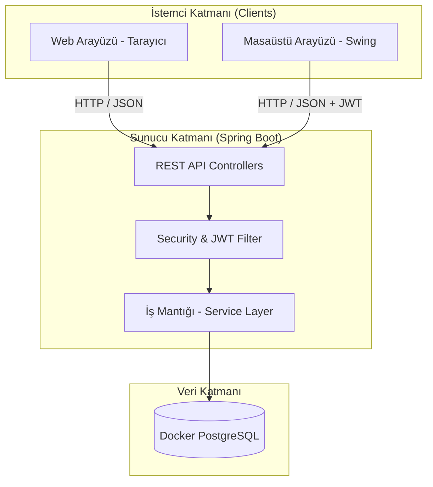

# Akıllı Kütüphane V4.1 Kurumsal — Spring Boot + PostgreSQL + Redis + Docker


---

## 🚀 V4.1 Yenilikleri (Özet)

| Özellik | V3 | V4.1 |
|---|---|---|
| **Framework** | Saf Java + HttpServer | **Spring Boot 3.2** |
| **Veritabanı** | SQLite / JSON | **PostgreSQL + pgvector** |
| **ORM** | JsonParser (manuel) | **Spring Data JPA + Hibernate** |
| **Kimlik Doğrulama** | SHA-256 + Session Token | **BCrypt + JWT + Spring Security** |
| **Rate Limiting** | ConcurrentHashMap | **Redis (ConcurrentHashMap fallback)** |
| **2FA** | Yok | **TOTP RFC 6238 (java-otp)** |
| **AI RAG** | Yok | **Gemini Embedding + pgvector (PostgreSQL)** |
| **Vision AI** | Yok | **Kitap Kapağı Tarama (Gemini Vision)** |
| **Konteyner** | Yok | **Docker Compose (3 servis)** |
| **CI/CD** | Yok | **GitHub Actions (mvn test)** |
| **Yetkilendirme** | Controller içi if-else | **@PreAuthorize + SecurityFilterChain** |
| **Split-Brain** | Swing ↔ SQLite / Web ↔ ? | **Swing ↔ REST API ↔ PostgreSQL ↔ Web** |
| **Performans** | N+1 sorgu | **Batch findAllById (2 sorgu)** |
| **Dosya Güvenliği** | Kullanıcı girdili isim | **UUID.randomUUID() + Path Traversal check** |
| **Seed Data** | Manuel | **DataInitializer (CommandLineRunner)** |

### Uygulama Ekran Görüntüleri

<p align="center">
  
  
</p>
<p align="center">
  
  
</p>
<p align="center">
  
  
</p>

---

## 1. Proje Özeti

Akıllı Kütüphane V4.1, V3'ün OOP temelli kütüphane yönetim sistemini **kurumsal Spring Boot mimarisine** taşıyan büyük bir dönüşümdür. Sistem; fiziksel kitaplar, dijital medyalar ve klasörleri JPA entity'leri olarak PostgreSQL'de saklar, Redis üzerinden rate limiting uygular, JWT ile güvenli API erişimi sağlar, TOTP tabanlı iki faktörlü doğrulama (2FA) sunar ve Docker Compose ile tek komutta ayağa kalkar.

Yapay zeka katmanı; Gemini Embedding API ile kitap vektörleştirme, pgvector ile kalıcı vektör depolama (RAG) ve Gemini Vision ile kitap kapağı tarama özelliklerini içerir.

**V4.1 (Split-Brain Fix):** Masaüstü Swing uygulaması (`gui/`) artık yerel SQLite yerine doğrudan Spring Boot REST API'ye bağlanır. `ApiClient.java` HTTP köprüsü ile JWT token yönetimi yapar. Web arayüzü ve masaüstü uygulaması **tek PostgreSQL veritabanını** paylaşır — veri uyumsuzluğu (split-brain) tamamen çözülmüştür.

## 2. Sistem Mimarisi (V4)



### Katmanlı Mimari

```
Controller  ──→  @RestController, @PreAuthorize("hasRole('ADMIN')")
  │
  ▼
Service     ──→  @Service, @Transactional, iş mantığı
  │
  ▼
Repository  ──→  JpaRepository, @Query (pgvector), findAllById (batch)
  │
  ▼
Entity      ──→  @Entity, SINGLE_TABLE, @MappedSuperclass, @Embeddable
  │
  ▼
Database    ──→  PostgreSQL 16 + pgvector (prod) / H2 file (dev)
```

## 3. Hızlı Başlangıç

### Gereksinimler

| Bileşen | Versiyon | Zorunlu? |
|---|---|---|
| Java | 17+ | ✅ |
| Maven | 3.8+ | ✅ |
| Docker Desktop | Son sürüm | ⚠️ (production modu) |
| Google Gemini API Key | — | ⚠️ (AI özellikleri) |

### Local Development (H2 veritabanı, Docker'sız)

```bash
# 1. Projeyi klonla
git clone <repo-url> && cd Akilli-kutup-v2

# 2. Derle ve başlat (DataInitializer seed data oluşturur)
mvn clean package -DskipTests
mvn spring-boot:run

# 3. Tarayıcıda aç
open http://localhost:8080

# 4. Test kullanıcıları (DataInitializer tarafından oluşturulur):
#    Admin: 11111111111 / 12345678
#    Admin: 33333333333 / 12345678
#    Üye:   44444444444 / 12345678
```

### Docker Compose (PostgreSQL + pgvector + Redis)

```bash
# Tek komutla tüm servisleri başlat
docker compose up -d

# Servisler:
#   - PostgreSQL 16 + pgvector → localhost:5433
#   - Redis 7                  → localhost:6380
#   - Spring Boot App          → localhost:8080

# Logları takip et
docker compose logs -f app

# Durdur
docker compose down
```

### Testleri Çalıştırma

```bash
# Tüm testler (52 adet: unit + JPA entegrasyon + E2E)
mvn clean test

# Sadece birim testler (33 adet)
mvn test -Dtest="CoreTest,AuthManagerTest,DatabaseManagerTest"

# Sadece JPA entegrasyon testleri (4 adet)
mvn test -Dtest="AkilliKutupV4IntegrationTest"

# Sadece E2E Split-Brain testi (13 adet — Spring Boot çalışıyor olmalı)
mvn test -Dtest="E2ESplitBrainTest"

# Shell E2E testi (curl tabanlı, 12 adım)
bash test-scripts/e2e_splitbrain_test.sh
```

## 4. Split-Brain Çözümü: Swing ↔ REST API ↔ Web

### Sorun

V3'te Swing masaüstü uygulaması yerel SQLite'a (`data/database.db`) yazıp okurken, web arayüzü Spring Boot REST API üzerinden PostgreSQL'e erişiyordu. Sonuç: iki arayüz farklı verileri görüyordu (**Split-Brain**).

### Çözüm

Swing GUI katmanı tamamen REST API istemcisine dönüştürüldü:

```
Swing GUI (AdminPanel / UserPanel / LoginPanel)
    │
    ▼
LibraryManager (singleton, veri erişim katmanı)
    │
    ▼
ApiClient (HTTP, JWT, JSON parse)
    │
    ▼
Spring Boot REST API (:8080)
    │
    ▼
PostgreSQL (tek veritabanı)
```

| Bileşen | Dosya | Görev |
|---|---|---|
| HTTP İstemci | `gui/ApiClient.java` | `java.net.http.HttpClient`, JWT token yönetimi, tüm CRUD |
| Veri Katmanı | `gui/LibraryManager.java` | SQLite yerine REST API proxy'si |
| Login | `gui/LoginPanel.java` | TC No + Şifre → `/api/giris` POST → JWT |
| Admin Panel | `gui/AdminPanel.java` | REST API üzerinden CRUD + `[REST API ✅]` göstergesi |
| Üye Panel | `gui/UserPanel.java` | SwingWorker ile asenkron ödünç alma |
| Seed Data | `config/DataInitializer.java` | İlk çalıştırmada admin/üye/kitap oluşturma |

### E2E Doğrulama

```bash
# Java: 13 adım, JUnit 5, ApiClient üzerinden
mvn test -Dtest=E2ESplitBrainTest
# → 13/13 PASS ✅

# Shell: 12 adım, curl, renkli çıktı
bash test-scripts/e2e_splitbrain_test.sh
# → Web → PostgreSQL → Swing → Aynı veri ✅
```

## 5. Çekirdek Mimari ve OOP Uygulamaları

- **Kalıtım (Inheritance)**: `IMateryal` → `Materyal` (@MappedSuperclass) → `Kitap`, `DijitalMedya`, `Klasor`. `Kullanici` (@Entity, SINGLE_TABLE) → `Admin` (@DiscriminatorValue("ADMIN")), `Uye` (@DiscriminatorValue("UYE")).
- **Çok Biçimlilik (Polymorphism)**: `cezaHesapla()` metodu her materyal türünde farklı formülle çalışır.
- **Kapsülleme (Encapsulation)**: `getTcNo(Kullanici talepEden)` — TC numarasına sadece admin veya kullanıcının kendisi erişebilir.
- **LSP (Liskov Substitution)**: `IOduncAlinabilir` arayüzü sadece ödünç alınabilir materyallerde. `Klasor` bu arayüzü implemente etmez — `instanceof` kontrolü ile LSP ihlali önlenir.
- **SRP (Single Responsibility)**: Servis katmanı (`KullaniciService`, `KitapService`, `BorrowService`) ve repository katmanı (5 JPA interface) ayrılmıştır.

### JPA Entity Hiyerarşisi

```
@MappedSuperclass
  Materyal (abstract)
    ├── @Entity Kitap           → kitaplar tablosu
    ├── @Entity DijitalMedya    → dijital_medyalar tablosu
    └── @Entity Klasor          → klasorler tablosu

@Entity @Inheritance(SINGLE_TABLE)
  Kullanici (abstract)
    ├── @DiscriminatorValue("ADMIN") Admin
    └── @DiscriminatorValue("UYE")   Uye

@Embeddable
  Bildirim                      → kullanici_bildirimler (ElementCollection)

@Entity
  KitapEmbedding                → kitap_embeddings (pgvector vector(768))
```

## 6. Güvenlik Katmanı (Defense-in-Depth)

### 6.1 Kimlik Doğrulama (Authentication)

```
Kullanıcı → POST /api/giris
         → RateLimiterService.isBlocked(ip) kontrolü
         → BCrypt passwordEncoder.matches()
         → Admin ise TOTP 2FA kontrolü (java-otp, RFC 6238)
         → JwtUtil.generateToken() → JWT (1 saat expiry)
         → Frontend/Swing: Authorization: Bearer <token>
         → JwtAuthFilter (OncePerRequestFilter): token → SecurityContext
```

### 6.2 Yetkilendirme (Authorization)

```java
// SecurityConfig.java — SecurityFilterChain
.authorizeHttpRequests(auth -> auth
    .requestMatchers("/api/status", "/api/giris").permitAll()
    .requestMatchers(HttpMethod.GET, "/api/kitaplar").permitAll()
    .requestMatchers("/api/kullanicilar/**", "/api/settings",
        "/api/backup", "/api/admin/**").hasRole("ADMIN")
    .requestMatchers(HttpMethod.POST, "/api/kitaplar").hasRole("ADMIN")
    .requestMatchers(HttpMethod.DELETE, "/api/kitaplar/**").hasRole("ADMIN")
    .anyRequest().authenticated()
)

// Controller seviyesinde çift katman
@PreAuthorize("hasRole('ADMIN')")
@PostMapping("/kitaplar")
```

### 6.3 Rate Limiting (Brute-Force Koruması)

```java
// RateLimiterService: Redis öncelikli, ConcurrentHashMap fallback
public boolean isBlocked(String ip)        // IP bloke mi?
public boolean recordFailedAttempt(String) // Başarısız deneme kaydet
public void resetAttempts(String)          // Başarılı girişte sıfırla
// 5 başarısız deneme → 5 dakika IP blokajı
```

### 6.4 Ek Güvenlik Önlemleri

| Önlem | Uygulama |
|---|---|
| Dosya Yükleme | `UUID.randomUUID() + extension`, `file.normalize().startsWith(dir)` |
| CORS | Sadece `localhost:8080`, `127.0.0.1:8080`, `localhost:3000` |
| CSRF | API stateless → disable |
| Session | `SessionCreationPolicy.STATELESS` |
| Hassas Veri | Login yanıtında `geminiApiKey` döndürülmez |
| Input Validasyon | Base64 5MB sınırı, sadece JPG/PNG |

## 7. Veri Katmanı (Persistence)

### 7.1 Veritabanı Stratejisi

```yaml
# application.yml
spring:
  datasource:
    url: ${DB_URL:jdbc:h2:file:./data/akilli_kutup;MODE=PostgreSQL}
    username: ${DB_USER:sa}
    driver-class-name: ${DB_DRIVER:org.h2.Driver}
  jpa:
    hibernate:
      ddl-auto: update
```

- **Local dev**: H2 file-based (PostgreSQL modunda), otomatik
- **Docker**: `DB_URL=jdbc:postgresql://postgres:5432/akilli_kutup` (docker-compose.yml'den enjekte)
- **Seed Data**: `DataInitializer` — ilk çalıştırmada 4 kullanıcı + 5 kitap (BCrypt şifreli)

### 7.2 Repository Katmanı (5 JPA Repository)

| Repository | Entity | Özel Metodlar |
|---|---|---|
| `KullaniciRepository` | Kullanici (Admin+Üye) | `findByTcNo`, `existsByEmailIgnoreCase` |
| `KitapRepository` | Kitap | `findByBaslikContainingIgnoreCase`, `findByYazarContainingIgnoreCase` |
| `DijitalMedyaRepository` | DijitalMedya | `findByTur`, `findByDosyaFormati` |
| `KlasorRepository` | Klasor | `findByBaslikContainingIgnoreCase` |
| `KitapEmbeddingRepository` | KitapEmbedding | `findNearest` (pgvector `<=>` cosine) |

### 7.3 N+1 Sorgu Optimizasyonu

```java
// ❌ ESKİ: N+1 (5000 kullanıcı × 3 kitap = 15.000 sorgu)
for (Kullanici k : kullaniciRepository.findAll()) {
    for (String mid : k.getOduncAlinanMateryaller()) {
        kitapRepository.findById(mid); // Her kitap için ayrı SELECT
    }
}

// ✅ YENİ: 2 sorgu (batch — sabit)
List<Kullanici> kullanicilar = kullaniciRepository.findAll();          // Sorgu 1
Set<String> tumIdler = ...;
Map<String, Kitap> kitapMap = kitapRepository.findAllById(tumIdler);   // Sorgu 2
```

### 7.4 Data Migration (SQLite → PostgreSQL)

```bash
mvn compile exec:java -Dexec.mainClass="com.akillikutup.db.DataMigrator"
```

## 8. API Endpoint Referansı (23 endpoint)

| Metod | Endpoint | Yetki | Açıklama |
|---|---|---|---|
| `GET` | `/api/status` | Public | Sunucu durumu |
| `POST` | `/api/giris` | Public | Giriş (JWT + opsiyonel 2FA) |
| `GET` | `/api/kitaplar` | Public | Kitap listesi |
| `POST` | `/api/kitaplar` | **ADMIN** | Kitap ekle (+ kapak upload) |
| `DELETE` | `/api/kitaplar/{id}` | **ADMIN** | Kitap sil |
| `GET` | `/api/kullanicilar` | **ADMIN** | Kullanıcı listesi |
| `POST` | `/api/kullanicilar` | **ADMIN** | Kullanıcı ekle |
| `PUT` | `/api/kullanicilar/{id}` | **ADMIN** | Kullanıcı güncelle |
| `DELETE` | `/api/kullanicilar/{id}` | **ADMIN** | Kullanıcı sil |
| `POST` | `/api/odunc` | Auth | Kitap ödünç ver |
| `POST` | `/api/iade` | Auth | Kitap iade al |
| `GET` | `/api/odunc-gecmisi` | Auth | Ödünç geçmişi |
| `GET` | `/api/istatistikler` | Auth | Sistem istatistikleri |
| `POST` | `/api/chat` | Auth | AI Sohbet (useRag:true → RAG) |
| `POST` | `/api/kitap-kapak-tara` | Auth | Vision AI kitap kapağı tarama |
| `GET` | `/api/settings` | **ADMIN** | Sistem ayarları |
| `POST` | `/api/settings` | **ADMIN** | Ayarları kaydet |
| `GET` | `/api/backup` | **ADMIN** | Veritabanı yedeği (ZIP) |
| `POST` | `/api/profil` | Auth | Profil güncelle |
| `POST` | `/api/sifre` | Auth | Şifre değiştir |
| `GET` | `/api/bildirimler` | Auth | Bildirimler |
| `POST` | `/api/bildirimler/okundu` | Auth | Tümünü okundu işaretle |
| `POST` | `/api/dijital/upload` | **ADMIN** | Dijital varlık ekle |
| `POST` | `/api/dijital/klasor` | **ADMIN** | Klasör oluştur |
| `POST` | `/api/admin/2fa-setup` | **ADMIN** | 2FA kurulumu |

## 9. Yapay Zeka Modülleri

### 9.1 RAG (Retrieval-Augmented Generation)

```
Kullanıcı Sorusu → Gemini Embedding API → sorgu vektörü (float[768])
                → pgvector cosine similarity (<=>) → en benzer 3 kitap
                → Gemini Generate API → kitap bağlamlı yanıt
```

- **Embedding Modeli**: `text-embedding-004` (768 boyut)
- **Vektör Depolama**: PostgreSQL `kitap_embeddings` tablosu, `vector(768)` kolonu
- **Benzerlik**: pgvector `<=>` kosinüs benzerlik operatörü

### 9.2 Vision AI (Kitap Kapağı Tarama)

```
Kamera Görseli (Base64) → Gemini Vision API → {baslik, yazar, isbn, kategori}
```

### 9.3 Model Fallback

`GeminiClient`: `gemini-2.0-flash-exp` → `gemini-1.5-pro-latest` → `gemini-1.5-flash-latest` → `gemini-pro`

## 10. Docker Compose Servisleri

```yaml
services:
  postgres:    # pgvector/pgvector:pg16
    port: 5433:5432
    env: POSTGRES_DB=akilli_kutup
    healthcheck: pg_isready

  redis:       # redis:7-alpine
    port: 6380:6379
    healthcheck: redis-cli ping

  app:         # Spring Boot 3.2
    port: 8080:8080
    depends_on: [postgres (healthy), redis (healthy)]
    env:
      DB_URL: jdbc:postgresql://postgres:5432/akilli_kutup
      DB_DRIVER: org.postgresql.Driver
      REDIS_HOST: redis
      JWT_SECRET: docker-compose-jwt-secret-change-in-production
```

## 11. CI/CD (GitHub Actions)

Her push ve PR'da: Java 17 → PostgreSQL 16 + Redis servis konteynerleri → `mvn clean compile` → `mvn test` → test raporu.

## 12. Test Kapsamı

| Test Sınıfı | Sayı | Tür |
|---|---|---|
| `CoreTest` | 4 | OOP + LSP + Güvenlik |
| `AuthManagerTest` | 1 | Kimlik doğrulama |
| `DatabaseManagerTest` | 28 | Veritabanı CRUD + Yedekleme |
| `AkilliKutupV4IntegrationTest` | 4 | JPA Repository + Service |
| `E2ESplitBrainTest` | 13 | Swing ↔ Web veri bütünlüğü |
| `e2e_splitbrain_test.sh` | 12 adım | curl tabanlı E2E |
| **Toplam** | **52 test + 12 adım** | Unit + Integration + E2E |

## 13. Proje Dosya Şeması (V4.1)

```text
Akilli-kutup-v2/
├── .github/workflows/ci.yml              # GitHub Actions CI
├── .gitignore
├── Dockerfile                             # Multi-stage (Maven → JRE)
├── docker-compose.yml                     # PostgreSQL + Redis + App
├── pom.xml                                # Spring Boot 3.2 parent
├── README.md
├── application.yml                        # Spring Boot konfigürasyonu
├── data/                                  # H2 veritabanı (local dev)
├── test-scripts/
│   └── e2e_splitbrain_test.sh            # curl E2E test scripti
├── frontend/                              # Web arayüzü (HTML/CSS/JS)
│   ├── index.html
│   ├── login.html
│   ├── css/ (login.css, main.css, scanner.css)
│   ├── js/ (api.js, auth.js, charts.js, main.js, ui.js, store.js, utils.js, scanner.js)
│   └── uploads/covers/
├── src/main/java/com/akillikutup/
│   ├── AkilliKutupApplication.java        # @SpringBootApplication
│   ├── config/
│   │   ├── SecurityConfig.java            # Spring Security + JWT + CORS
│   │   ├── JwtUtil.java                   # JWT üretim/doğrulama (jjwt)
│   │   ├── JwtAuthFilter.java             # OncePerRequestFilter
│   │   ├── RateLimiterService.java        # Redis + ConcurrentHashMap fallback
│   │   ├── TotpService.java              # TOTP RFC 6238 (java-otp)
│   │   └── DataInitializer.java          # Seed data (CommandLineRunner)
│   ├── controller/
│   │   ├── AuthController.java            # /api/giris, 2FA setup
│   │   ├── BookController.java            # /api/kitaplar
│   │   ├── BorrowController.java          # /api/odunc, /api/iade
│   │   └── GeneralController.java         # Kullanıcı, İstatistik, Chat, Settings...
│   ├── core/
│   │   ├── Materyal.java (@MappedSuperclass)
│   │   ├── Kitap.java, DijitalMedya.java, Klasor.java (@Entity)
│   │   ├── Kullanici.java (@Entity, SINGLE_TABLE)
│   │   ├── Admin.java, Uye.java (@DiscriminatorValue)
│   │   ├── Bildirim.java (@Embeddable)
│   │   ├── KitapEmbedding.java (pgvector)
│   │   └── IOduncAlinabilir.java, IMateryal.java, ConfigManager.java
│   ├── repository/
│   │   ├── KullaniciRepository.java
│   │   ├── KitapRepository.java
│   │   ├── DijitalMedyaRepository.java
│   │   ├── KlasorRepository.java
│   │   └── KitapEmbeddingRepository.java
│   ├── service/
│   │   ├── KullaniciService.java          # BCrypt + CRUD
│   │   ├── KitapService.java             # Kitap CRUD
│   │   └── BorrowService.java            # Ödünç/iade + batch sorgu
│   ├── gui/                               # Swing masaüstü (REST API client)
│   │   ├── ApiClient.java                # HTTP + JWT + JSON
│   │   ├── LibraryManager.java           # REST API proxy'si
│   │   ├── LoginPanel.java               # TC + Şifre → /api/giris
│   │   ├── AdminPanel.java               # Admin CRUD
│   │   ├── UserPanel.java                # Üye ödünç alma
│   │   └── MainFrame.java                # Ana pencere
│   ├── server/
│   │   ├── ApiServer.java                # Eski HTTP sunucusu (korunuyor)
│   │   ├── GeminiClient.java             # Gemini AI + Vision + Embedding
│   │   └── RagService.java               # pgvector RAG
│   ├── db/                                # Eski SQLite katmanı (korunuyor)
│   │   ├── DatabaseManager.java
│   │   ├── DataMigrator.java             # SQLite → PostgreSQL
│   │   ├── JsonParser.java
│   │   ├── BackupManager.java
│   │   └── FileEncryptionService.java
│   └── auth/AuthManager.java             # Eski auth (korunuyor)
└── src/test/java/com/akillikutup/
    ├── AkilliKutupV4IntegrationTest.java  # @DataJpaTest (4 test)
    ├── E2ESplitBrainTest.java            # E2E Split-Brain (13 test)
    ├── auth/AuthManagerTest.java
    ├── core/CoreTest.java
    └── db/DatabaseManagerTest.java
```

## 14. EKİP GÖREV DAĞILIMI

**Backend & Core Architect — Ahmet Güler**: OOP sınıf hiyerarşisi, entity tasarımı, JPA anotasyonları, çekirdek iş mantığı, ceza hesaplama algoritmaları, CoreTest.

**Database & Security Architect — Arda Meçik**: Spring Boot geçişi, JPA repository katmanı, PostgreSQL + pgvector, DataMigrator, Docker Compose, CI/CD, JWT + @PreAuthorize + Rate Limiting + TOTP 2FA, DatabaseManagerTest, AuthManagerTest.

**UI/UX Developer — Göktuğ Berke Kuzucu**: Modern web arayüzü (HTML/CSS/JS), karanlık tema, barkod tarayıcı, grafik ve dashboard bileşenleri, responsive tasarım, frontend dosyaları.

**Security & Integration Specialist — Eren Gider**: REST API katmanı, Gemini AI (Chat + Vision + Embedding), RAG servisi, CORS, AuthController, ApiServer, GeminiClient, README, UML diyagramları, sistem dokümantasyonu.

---

**Sürüm**: 4.1.0-Kurumsal (Split-Brain Fix) | **Test**: 52/52 ✅ | **Lisans**: MIT
