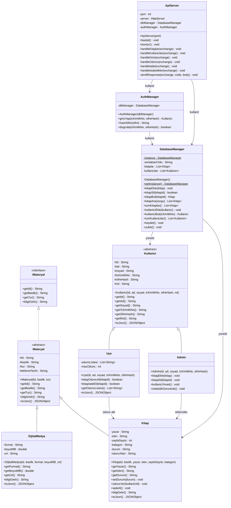

# UML Sinif Diyagrami

Akilli Kutuphane ve Guvenli Dijital Varlik Yonetim Sistemi icin sinif diyagrami.

## Iliskiler

| Iliski | Aciklama |
|--------|----------|
| `IMateryal <\|.. Materyal` | Materyal sinifi IMateryal arayuzunu uygular |
| `Materyal <\|-- Kitap` | Kitap sinifi Materyal soyut sinifini genisletir |
| `Materyal <\|-- DijitalMedya` | DijitalMedya sinifi Materyal soyut sinifini genisletir |
| `Kullanici <\|-- Admin` | Admin sinifi Kullanici soyut sinifini genisletir |
| `Kullanici <\|-- Uye` | Uye sinifi Kullanici soyut sinifini genisletir |
| `DatabaseManager --> Kitap` | DatabaseManager kitaplari yonetir (composition) |
| `DatabaseManager --> Kullanici` | DatabaseManager kullanicilari yonetir (composition) |
| `AuthManager --> DatabaseManager` | AuthManager veritabani erisimi icin DatabaseManager kullanir |
| `ApiServer --> DatabaseManager` | ApiServer veri islemleri icin DatabaseManager kullanir |
| `ApiServer --> AuthManager` | ApiServer kimlik dogrulama icin AuthManager kullanir |

## Tasarim Desenleri

- **Singleton**: `DatabaseManager` tek ornek olarak calisir
- **Template Method**: `Materyal` soyut sinifinda `bilgiGetir()` metodu
- **Strategy**: Farkli materyal turleri icin farkli `bilgiGetir()` uygulamalari
