# UML Sınıf Diyagramı

Akıllı Kütüphane ve Güvenli Dijital Varlık Yönetim Sistemi için güncel sınıf diyagramı.

```mermaid
classDiagram
    direction TB

    class IMateryal {
        <<interface>>
        +cezaHesapla(gecikmeGunu) double
        +stoktaVarMi() boolean
    }

    class IOduncAlinabilir {
        <<interface>>
        +oduncVer() void
        +iadeEt() void
    }

    class Materyal {
        <<abstract>>
        -id : String
        -baslik : String
        #stokAdedi : int
        -birimFiyat : double
        +Materyal(baslik, stokAdedi, birimFiyat)
        +stoktaVarMi() boolean
        +cezaHesapla(gecikmeGunu) double*
        +getBaslik() String
        +getBirimFiyat() double
        +getStokAdedi() int
        +getId() String
        +setId(id) void
    }

    class Kitap {
        -isbn : String
        +Kitap(baslik, stokAdedi, birimFiyat, isbn)
        +oduncVer() void
        +iadeEt() void
        +cezaHesapla(gecikmeGunu) double
        +getIsbn() String
    }

    class DijitalMedya {
        -dosyaFormati : String
        -sonUretilenLisans : String
        -toplamErisimSayisi : int
        -MAX_ERISIM_LIMITI : int
        +DijitalMedya(baslik, birimFiyat, dosyaFormati)
        +stoktaVarMi() boolean
        +oduncVer() void
        +iadeEt() void
        +cezaHesapla(gun) double
        +getSonUretilenLisans() String
        +getToplamErisimSayisi() int
        +setToplamErisimSayisi(toplamErisimSayisi) void
        +getDosyaFormati() String
    }

    class Klasor {
        +Klasor(baslik)
        +stoktaVarMi() boolean
        +cezaHesapla(gecikmeGunu) double
    }

    class SystemTester {
        +main(args) void$
    }

    class Kullanici {
        <<abstract>>
        -id : String
        -isim : String
        -tcNo : String
        -rol : String
        -sifre : String
        -token : String
        -tokenExpiry : long
        #krediPuani : int
        #oduncAlinanMateryaller : List~String~
        #bildirimler : List~Bildirim~
        #geminiApiKey : String
        +Kullanici(isim, tcNo, rol, sifre)
        +getTcNo(talepEden) String
        +getId() String
        +setId(id) void
        +getToken() String
        +setToken(token) void
        +getTokenExpiry() long
        +setTokenExpiry(tokenExpiry) void
        +goreviniYap() void*
        +getIsim() String
        +getRol() String
        +getSifre() String
        +getKrediPuani() int
        +getTcNoDogrudan() String
        +setTcNo(tcNo) void
        +setSifre(sifre) void
        +setIsim(isim) void
        +getOduncAlinanMateryaller() List~String~
        +getBildirimler() List~Bildirim~
        +materyalOduncAl(materyalId) void
        +materyalIadeEt(materyalId) void
        +getGeminiApiKey() String
        +setGeminiApiKey(geminiApiKey) void
    }

    class Admin {
        +Admin(isim, tcNo, sifre)
        +goreviniYap() void
        +envanterEkle(m) void
    }

    class Uye {
        +Uye(isim, tcNo, sifre)
        +goreviniYap() void
        +materyalAl(m) void
        +puanGuncelle(miktar) void
    }

    class Bildirim {
        -id : String
        -type : String
        -icon : String
        -text : String
        -time : String
        -unread : boolean
        +Bildirim()
        +Bildirim(type, icon, text, time)
        +getId() String
        +setId(id) void
        +getType() String
        +setType(type) void
        +getIcon() String
        +setIcon(icon) void
        +getText() String
        +setText(text) void
        +getTime() String
        +setTime(time) void
        +isUnread() boolean
        +setUnread(unread) void
    }

    class DatabaseManager {
        -tekOrnek : DatabaseManager$
        +isTestMode : boolean$
        -kullaniciListesi : List~Kullanici~
        -materyalListesi : List~Materyal~
        -lock : ReadWriteLock
        -dataSource : HikariDataSource
        -scheduler : ScheduledExecutorService
        -shutdownHook : Thread
        -DatabaseManager()
        +tekOrnekAl() DatabaseManager$
        +tekOrnekSifirla() void$
        -getConnection() Connection
        -baslatYedeklemeZamanlayici() void
        -initDb() void
        +kaydet(kullanicilar, materyaller) void
        +kullanicilariKaydet() void
        +materyallariKaydet() void
        +kullanicilariYukle() List~Kullanici~
        +materyallariYukle() List~Materyal~
        +yedekle() void
        +senkronizeEt(kullanicilar, materyaller) void
        +kullaniciEkle(yeniKullanici) void
        +kullaniciSil(kullaniciIsmi) void
        +materyalEkle(yeniMateryal) void
        +materyalSil(materyalId) void
        +kullaniciBul(id) Kullanici
        +materyalBul(id) Materyal
        +materyalAra(aramaKelimesi) List~Materyal~
        +veritabaniMevcutMu() boolean
        +getKullaniciListesi() List~Kullanici~
        +getMateryalListesi() List~Materyal~
    }

    class BackupManager {
        -YEDEK_KLASORU : String
        -KULLANICI_DOSYASI : String
        -MATERYAL_DOSYASI : String
        +BackupManager(yedekKlasoru, kullaniciDosyasi, materyalDosyasi)
        +yedekle() void
        +yedektenKurtar(hedefDosyaYolu) boolean
        -eskiYedekleriTemizle(maxYedekSayisi) void
        -dosyaKopyala(kaynak, hedef) void
    }

    class FileEncryptionService {
        -ANAHTAR_DOSYASI : String$
        -GCM_IV_LENGTH : int$
        -GCM_TAG_LENGTH : int$
        -gizliAnahtar : SecretKey$
        +init() void$
        +encrypt(value) String$
        +decrypt(encryptedValue) String$
        +dosyaErisiminiKisila(yol) void$
    }

    class JsonParser {
        -gson : Gson$
        +serializeKullanici(k) String$
        +serializeMateryal(m) String$
        +deserializeKullanici(json) Kullanici$
        +deserializeMateryal(json) Materyal$
        +serializeKullanicilar(kullaniciListesi) String$
        +serializeMateryaller(materyalListesi) String$
        +deserializeKullanicilar(json) List~Kullanici~
        +deserializeMateryaller(json) List~Materyal~
    }

    class ConfigManager {
        -CONFIG_FILE : String$
        -geminiApiKey : String$
        -configData : JsonObject$
        -gson : Gson$
        -DEFAULT_API_KEY : String$
        +init() void$
        -createDefaultConfig() JsonObject$
        -checkDefaults() void$
        +saveConfig() void$
        +getConfigData() JsonObject$
        +updateConfigData(newData) void$
        +getGeminiApiKey() String$
    }

    class AuthManager {
        -db : DatabaseManager
        -failedAttempts : ConcurrentHashMap~String, Integer~
        -lockoutTimes : ConcurrentHashMap~String, Long~
        -MAX_FAILED_ATTEMPTS : int$
        -LOCKOUT_DURATION_MS : long$
        +AuthManager()
        +hashPassword(password, salt) String
        +generateSalt() byte[]
        +login(tcNo, plainPassword, ipAddress) Kullanici
        +registerPassword(plainPassword) String
        +createSession(user) String
        +getUserByToken(token) Kullanici
    }

    class GeminiClient {
        -API_BASE_URL : String$
        -MODELS : String[]$
        -httpClient : HttpClient$
        -gson : Gson$
        +askQuestion(prompt, userApiKey) String$
        -parseGeminiResponse(jsonResponse) String$
    }

    class ApiServer {
        -server : HttpServer
        -gson : Gson
        -authManager : AuthManager
        +startServer(port) void
        +stopServer() void
        -sendResponse(t, statusCode, response) void
        -verifyAuth(t) Kullanici
        -handleCors(t, allowedMethods) boolean
        -findUserById(db, id) Kullanici
    }

    class MainFrame {
        -cardLayout : CardLayout
        -mainPanel : JPanel
        +MainFrame()
        +showPanel(panelName) void
    }

    class LibraryManager {
        -instance : LibraryManager$
        -users : List~Kullanici~
        -materials : List~Materyal~
        -currentUser : Kullanici
        -LibraryManager()
        +getInstance() LibraryManager$
        +addUser(user) void
        +getUsers() List~Kullanici~
        +getMaterials() List~Materyal~
        +getCurrentUser() Kullanici
        +setCurrentUser(currentUser) void
        +addMaterial(m) void
        +removeUser(user) void
        +removeMaterial(m) void
    }

    IMateryal <|.. Materyal
    IOduncAlinabilir <|.. Kitap
    IOduncAlinabilir <|.. DijitalMedya
    Materyal <|-- Kitap
    Materyal <|-- DijitalMedya
    Materyal <|-- Klasor
    Kullanici <|-- Admin
    Kullanici <|-- Uye
    Kullanici o--> "0..*" Bildirim : has
    DatabaseManager o--> "0..*" Kitap : manages
    DatabaseManager o--> "0..*" Kullanici : manages
    DatabaseManager --> JsonParser : uses
    DatabaseManager --> FileEncryptionService : uses
    LibraryManager --> DatabaseManager : uses
    LibraryManager o--> "0..*" Kullanici : manages
    LibraryManager o--> "0..*" Materyal : manages
    AuthManager --> DatabaseManager : uses
    ApiServer --> DatabaseManager : uses
    ApiServer --> AuthManager : uses
    ApiServer --> GeminiClient : delegates to
    ConfigManager --> FileEncryptionService : uses
    GeminiClient --> ConfigManager : reads global key
```

## İlişkiler

| İlişki | Açıklama |
|--------|----------|
| `IMateryal <\|.. Materyal` | `Materyal` sınıfı `IMateryal` arayüzünü uygular |
| `IOduncAlinabilir <\|.. Kitap` | `Kitap` sınıfı fiziksel bir obje olarak ödünç alınabilirlik davranışını uygular |
| `IOduncAlinabilir <\|.. DijitalMedya` | `DijitalMedya` sınıfı sanal bir lisans kiralama davranışını uygular |
| `Materyal <\|-- Kitap` | `Kitap` sınıfı `Materyal` soyut sınıfını genişletir |
| `Materyal <\|-- DijitalMedya` | `DijitalMedya` sınıfı `Materyal` soyut sınıfını genişletir |
| `Materyal <\|-- Klasor` | `Klasor` sınıfı dijital varlık yönetimi için yalnızca soyut gösterim (Materyal) sağlar |
| `Kullanici <\|-- Admin` | `Admin` sınıfı `Kullanici` soyut sınıfını genişletir |
| `Kullanici <\|-- Uye` | `Uye` sınıfı `Kullanici` soyut sınıfını genişletir |
| `Kullanici o--> Bildirim` | `Kullanici` nesnesi sıfır veya daha fazla `Bildirim` nesnesi barındırır (Aggregation) |
| `DatabaseManager o--> Kitap` | `DatabaseManager` kitap listesini yönetir |
| `DatabaseManager o--> Kullanici` | `DatabaseManager` kullanıcı listesini yönetir |
| `DatabaseManager --> JsonParser` | `DatabaseManager` JSON serileştirme/serileştirmeden çıkarma işlemleri için `JsonParser` kullanır |
| `DatabaseManager --> FileEncryptionService` | `DatabaseManager` verileri diske yazarken AES şifreleme/çözme işlemleri için `FileEncryptionService` kullanır |
| `LibraryManager --> DatabaseManager` | GUI katmanının tek noktadan erişimi için `LibraryManager`, `DatabaseManager`'a delegasyon yapar |
| `AuthManager --> DatabaseManager` | `AuthManager` kimlik doğrulama ve kullanıcı oturumu işlemleri için `DatabaseManager` kullanır |
| `ApiServer --> DatabaseManager` | `ApiServer` REST API veri taleplerini karşılamak için `DatabaseManager` kullanır |
| `ApiServer --> AuthManager` | `ApiServer` Bearer token doğrulama ve giriş işlemlerini yönetmek için `AuthManager` kullanır |
| `ApiServer --> GeminiClient` | Yapay zeka asistanı istekleri `GeminiClient` sınıfına yönlendirilir |
| `ConfigManager --> FileEncryptionService` | `ConfigManager` Gemini API anahtarını şifrelenmiş olarak `config.json` dosyasında saklamak/okumak için kullanır |
| `GeminiClient --> ConfigManager` | `GeminiClient` kullanıcıya özel anahtar olmadığında sistem genelindeki global API anahtarını `ConfigManager` üzerinden okur |

## Tasarım Desenleri

- **Singleton (Tek Nesne)**: `DatabaseManager` ve `LibraryManager` sınıfları tek örnek olarak çalışacak şekilde tasarlanmıştır (`tekOrnekAl()` / `getInstance()`).
- **Template Method (Şablon Yöntem)**: `Materyal` soyut sınıfında tanımlanan abstract metotlar (`oduncVer()`, `iadeEt()`, `cezaHesapla()`) alt sınıflarda özel iş mantıklarıyla ezilerek uygulanır.
- **Facade (Alt Sistem Arayüzü)**: `LibraryManager` sınıfı, Swing GUI katmanının backend iş mantığı ve veritabanı işlemlerine basitleştirilmiş tek bir arayüz üzerinden erişmesini sağlar.
- **Double-Checked Locking (Çift Kontrollü Kilitleme)**: `DatabaseManager` singleton kurulumunda ve verilerin yüklenmesi süreçlerinde çoklu kanal (thread) güvenliği için çift kontrollü kilit mekanizması uygulanmıştır.
- **Strategy (Strateji)**: Materyal türlerine göre (Kitap veya DijitalMedya) ödünç verme kuralları ve ceza hesaplama katsayıları dinamik olarak değişir.
