# UML Sınıf Diyagramı (V4.2)

Akıllı Kütüphane ve Güvenli Dijital Varlık Yönetim Sistemi için güncel sınıf diyagramı.
Spring Boot 3.2 + JPA + JWT + pgvector + Redis mimarisine uygundur.

```mermaid
classDiagram
    direction TB

    class IMateryal {
        <<interface>>
        +cezaHesapla(gecikmeGunu) double
        +stoktaVarMi() boolean
        +getMateryalTuru() String
    }

    class IOduncAlinabilir {
        <<interface>>
        +oduncVer() void
        +iadeEt() void
    }

    class Materyal {
        <<abstract @MappedSuperclass>>
        -id : String
        -baslik : String
        #stokAdedi : int
        -birimFiyat : double
        +Materyal(baslik, stokAdedi, birimFiyat)
        +stoktaVarMi() boolean
        +cezaHesapla(gecikmeGunu) double*
        +getMateryalTuru() String*
        +setId(id) void
        +setBaslik(baslik) void
        +setBirimFiyat(birimFiyat) void
        +getId() String
        +getBaslik() String
        +getBirimFiyat() double
        +getStokAdedi() int
    }

    class Kitap {
        <<@Entity>>
        -isbn : String
        -yazar : String
        -kategori : String
        -kapakGorseli : String
        +Kitap(baslik, stokAdedi, birimFiyat, isbn)
        +getMateryalTuru() String
        +oduncVer() void
        +iadeEt() void
        +cezaHesapla(gecikmeGunu) double
        +setYazar(yazar) void
        +setKategori(kategori) void
        +setKapakGorseli(kapakGorseli) void
        +getIsbn() String
        +getYazar() String
        +getKategori() String
        +getKapakGorseli() String
    }

    class DijitalMedya {
        <<@Entity>>
        -dosyaFormati : String
        -tur : String
        -boyut : String
        -sonUretilenLisans : String
        -toplamErisimSayisi : int
        -MAX_ERISIM_LIMITI : int
        +DijitalMedya(baslik, birimFiyat, dosyaFormati, tur, boyut)
        +getMateryalTuru() String
        +stoktaVarMi() boolean
        +oduncVer() void
        +iadeEt() void
        +cezaHesapla(gun) double
        +getDosyaFormati() String
        +getTur() String
        +getBoyut() String
        +getSonUretilenLisans() String
        +getToplamErisimSayisi() int
        +setDosyaFormati(format) void
        +setTur(tur) void
        +setBoyut(boyut) void
        +setToplamErisimSayisi(n) void
    }

    class Klasor {
        <<@Entity>>
        +Klasor(baslik)
        +getMateryalTuru() String
        +stoktaVarMi() boolean
        +cezaHesapla(gecikmeGunu) double
    }

    class KitapEmbedding {
        <<@Entity>>
        -id : String
        -kitapId : String
        -embedding : float[]
        +KitapEmbedding(kitapId, embedding)
    }

    class User {
        <<@Entity>>
        -id : String
        -isim : String
        -tcNo : String
        -rol : Role
        -sifre : String
        -token : String
        -tokenExpiry : long
        -krediPuani : int
        -totpSecretKey : String
        -ikiFAEtkin : boolean
        -email : String
        -geminiApiKey : String
        -oduncAlinanMateryaller : List~String~
        -oduncTarihleri : Map~String,String~
        -iadeTarihleri : Map~String,String~
        -oduncCeza : Map~String,Double~
        -bildirimler : List~Bildirim~
        +User(isim, tcNo, rol, sifre)
        +getTcNo(talepEden) String
        +getTcNoDogrudan() String
        +materyalOduncAl(materyalId) void
        +materyalIadeEt(materyalId) void
        +puanGuncelle(miktar) void
    }

    class Role {
        <<enumeration>>
        ADMIN
        UYE
    }

    class Bildirim {
        -id : String
        -type : String
        -icon : String
        -text : String
        -time : String
        -unread : boolean
        +Bildirim()
        +Bildirim(type, icon, text, time)
    }

    class JwtUtil {
        <<@Component>>
        -key : SecretKey
        -expirationMs : long
        +JwtUtil(secret, expirationMs)
        +generateToken(userId, rol, isim) String
        +extractUserId(token) String
        +extractRole(token) String
        +isTokenValid(token) boolean
    }

    class JwtAuthFilter {
        <<@Component>>
        -jwtUtil : JwtUtil
        -sessionService : ActiveSessionService
        +doFilterInternal(request, response, chain) void
    }

    class SecurityConfig {
        <<@Configuration>>
        +securityFilterChain(http) SecurityFilterChain
        +passwordEncoder() PasswordEncoder
    }

    class RateLimiterService {
        <<@Service>>
        +isBlocked(ipAddress) boolean
        +recordFailedAttempt(ipAddress) void
        +resetAttempts(ipAddress) void
    }

    class TotpService {
        <<@Service>>
        +generateSecretKey() String
        +generateProvisioningUri(user, secret) String
        +verifyCode(secret, code) boolean
    }

    class AuthController {
        <<@RestController>>
        -jwtUtil : JwtUtil
        -rateLimiter : RateLimiterService
        -totpService : TotpService
        -userService : UserService
        -passwordEncoder : PasswordEncoder
        +login(LoginRequest) LoginResponse
        +logout(request) Map
        +setup2FA(request) TwoFactorSetupResponse
    }

    class UserController {
        <<@RestController>>
        -userService : UserService
        +getUsers() List~UserResponse~
        +addUser(UserCreateRequest) ResponseEntity
        +updateUser(id, UserUpdateRequest) ResponseEntity
        +deleteUser(id) ResponseEntity
    }

    class BookController {
        <<@RestController>>
        -kitapService : KitapService
        +getBooks() List~BookResponse~
        +addBook(request) ResponseEntity
        +deleteBook(id) ResponseEntity
    }

    class MaterialController {
        <<@RestController>>
        +uploadDigitalAsset(request) ResponseEntity
        +createFolder(request) ResponseEntity
        +scanBookCover(request) ResponseEntity
    }

    class BorrowController {
        <<@RestController>>
        -borrowService : BorrowService
        +borrowBook(request) ResponseEntity
        +returnBook(request) ResponseEntity
        +getBorrowHistory() ResponseEntity
    }

    class ChatController {
        <<@RestController>>
        -ragService : RagService
        +chat(ChatRequest) ChatResponse
    }

    class BackupController {
        <<@RestController>>
        -borrowService : BorrowService
        +status() ResponseEntity
        +getStats() ResponseEntity
        +getSettings() ResponseEntity
        +saveSettings(request) ResponseEntity
        +backup() ResponseEntity
        +updateProfile(request) ResponseEntity
        +changePassword(request) ResponseEntity
        +getNotifications(request) ResponseEntity
        +markNotificationsRead(request) ResponseEntity
    }

    class ActiveSessionService {
        <<@Service>>
        +registerSession(userId, name, role, ip) void
        +removeSession(userId) void
        +getSession(userId) Optional~ActiveSession~
        +getActiveCount() long
        +updateActivity(userId, action) void
    }

    class SseService {
        <<@Service>>
        +broadcastActiveCount(count) void
        +broadcastUserJoined(name, action) void
        +broadcastUserLeft(name) void
        +createSseEmitter(userId) SseEmitter
    }

    class GeminiClient {
        -API_BASE_URL : String$
        -MODELS : String[]$
        -httpClient : HttpClient$
        -gson : Gson$
        +askQuestion(prompt, userApiKey) String$
        +analyzeBookCover(base64Image, mimeType, key) String$
        +generateEmbedding(text, key) float[]$
        +cosineSimilarity(a, b) double$
    }

    class RagService {
        <<@Service>>
        -kitapEmbeddingRepository : KitapEmbeddingRepository
        -geminiClient : GeminiClient
        +searchSimilar(query, limit) List~Kitap~
        +generateRagResponse(prompt) String
    }

    class DatabaseManager {
        -tekOrnek : DatabaseManager$
        -kullaniciListesi : List~User~
        -materyalListesi : List~Materyal~
        +tekOrnekAl() DatabaseManager$
        +getKullaniciListesi() List~User~
        +getMateryalListesi() List~Materyal~
        +kullanicilariKaydet() void
        +materyallariKaydet() void
        +kullanicilariYukle() List~User~
        +materyallariYukle() List~Materyal~
        +kullaniciEkle(yeniKullanici) void
        +materyalEkle(yeniMateryal) void
        +yedekle() void
    }

    class AuthManager {
        -db : DatabaseManager
        -failedAttempts : ConcurrentHashMap
        -lockoutTimes : ConcurrentHashMap
        -activeSessions : ConcurrentHashMap
        +hashPassword(password, salt) String
        +generateSalt() byte[]
        +login(tcNo, plainPassword, ipAddress) User
        +registerPassword(plainPassword) String
        +createSession(user) String
        +getUserByToken(token) User
    }

    class FileEncryptionService {
        -ANAHTAR_DOSYASI : String$
        -GCM_IV_LENGTH : int$
        -GCM_TAG_LENGTH : int$
        -gizliAnahtar : SecretKey$
        +init() void$
        +encrypt(value) String$
        +decrypt(encryptedValue) String$
    }

    class ApiServer {
        -server : HttpServer
        -gson : Gson
        -authManager : AuthManager
        +startServer(port) void
        +stopServer() void
    }

    class ConfigManager {
        -CONFIG_FILE : String$
        -geminiApiKey : String$
        -configData : JsonObject$
        +init() void$
        +getConfigData() JsonObject$
        +updateConfigData(newData) void$
        +getGeminiApiKey() String$
    }

    class DataMigrator {
        +main(args) void$
    }

    IMateryal <|.. Materyal
    IOduncAlinabilir <|.. Kitap
    IOduncAlinabilir <|.. DijitalMedya
    Materyal <|-- Kitap
    Materyal <|-- DijitalMedya
    Materyal <|-- Klasor
    User *-- Role : has
    User o--> "0..*" Bildirim : has
    User o--> "0..*" KitapEmbedding : RAG context
    DatabaseManager o--> "0..*" User : manages
    DatabaseManager o--> "0..*" Materyal : manages
    DatabaseManager --> FileEncryptionService : uses
    AuthManager --> DatabaseManager : uses
    AuthController --> JwtUtil : uses
    AuthController --> RateLimiterService : uses
    AuthController --> TotpService : uses
    AuthController --> UserService : uses
    AuthController --> ActiveSessionService : uses
    AuthController --> SseService : uses
    JwtAuthFilter --> JwtUtil : uses
    JwtAuthFilter --> ActiveSessionService : uses
    BookController --> KitapService : uses
    MaterialController --> KitapService : uses
    BorrowController --> BorrowService : uses
    ChatController --> RagService : uses
    RagService --> GeminiClient : uses
    BackupController --> BorrowService : uses
    BackupController --> ConfigManager : uses
    ApiServer --> DatabaseManager : uses
    ApiServer --> AuthManager : uses
    ApiServer --> GeminiClient : uses
    ConfigManager --> FileEncryptionService : uses
    GeminiClient --> ConfigManager : uses
    DataMigrator --> DatabaseManager : uses
```

## İlişkiler

| İlişki | Açıklama |
|--------|----------|
| `IMateryal <\|.. Materyal` | `Materyal` soyut sınıfı `IMateryal` arayüzünü uygular |
| `IOduncAlinabilir <\|.. Kitap` | `Kitap` fiziksel ödünç alınabilir davranışını uygular |
| `IOduncAlinabilir <\|.. DijitalMedya` | `DijitalMedya` lisans kiralama davranışını uygular |
| `Materyal <\|-- Kitap` | `Kitap` → `kitaplar` tablosu (JPA @Entity) |
| `Materyal <\|-- DijitalMedya` | `DijitalMedya` → `dijital_medyalar` tablosu (JPA @Entity) |
| `Materyal <\|-- Klasor` | `Klasor` → `klasorler` tablosu (JPA @Entity) |
| `User *-- Role` | `User` entity'si `Role` enum'ını taşır (ADMIN/UYE) — V4.2'de Admin/Uye kalıtımı kaldırılmıştır |
| `User o--> Bildirim` | Kullanıcı sıfır veya daha fazla bildirime sahiptir (@ElementCollection) |
| `AuthController --> JwtUtil` | Giriş işleminde JWT token üretimi |
| `JwtAuthFilter --> JwtUtil` | Her istekte Bearer token doğrulaması (OncePerRequestFilter) |
| `ChatController --> RagService` | AI sohbet istekleri RAG pipeline'ına yönlendirilir |
| `RagService --> GeminiClient` | Embedding üretimi ve LLM yanıtı için Gemini API kullanılır |
| `ConfigManager --> FileEncryptionService` | Gemini API anahtarı AES-256/GCM ile şifrelenerek saklanır |
| `DataMigrator --> DatabaseManager` | SQLite → PostgreSQL veri göçü |

## Tasarım Desenleri

- **Singleton (Tek Nesne)**: `DatabaseManager` (`tekOrnekAl()`)
- **Template Method (Şablon Yöntem)**: `Materyal` soyut sınıfında tanımlanan `cezaHesapla()`, `getMateryalTuru()` alt sınıflarda ezilir
- **Strategy (Strateji)**: Materyal türüne göre (Kitap, DijitalMedya, Klasor) ceza hesaplama ve ödünç verme kuralları dinamik değişir
- **Chain of Responsibility**: `JwtAuthFilter` → `SecurityContext` → `@PreAuthorize` zinciri
- **Observer**: `SseService` ile aktif kullanıcı değişiklikleri tarayıcılara SSE ile anlık bildirilir
- **Repository**: Spring Data JPA `JpaRepository` ile veri erişimi (KitapRepository, UserRepository, vb.)

## V4.2 Mimari Değişiklikler (V3/V4.0'dan farklar)

| Özellik | V3/V4.0 | V4.2 |
|---|---|---|
| **Kullanıcı Modeli** | `Kullanici` soyut sınıfı → `Admin`, `Uye` kalıtımı | `User` @Entity + `Role` enum (ADMIN, UYE) |
| **Veritabanı** | SQLite (tek dosya) | PostgreSQL 16 + pgvector (prod), H2 (dev) |
| **API** | `com.sun.net.httpserver` (ApiServer) | Spring Boot REST + eski ApiServer paralel |
| **Kimlik Doğrulama** | UUID token (AuthManager) | JWT (jjwt) + Spring Security filter chain |
| **2FA** | Yok | TOTP (Google Authenticator, RFC 6238) |
| **Rate Limiting** | Yok | Redis tabanlı (`RateLimiterService`) |
| **Gerçek Zamanlı** | Yok | SSE (`SseService`) ile aktif kullanıcı takibi |
| **AI/Embedding** | Gemini sohbet | Gemini sohbet + RAG (pgvector `KitapEmbedding`) |
| **Paket Yapısı** | Katman bazlı | Package by Feature (auth/user/material/borrow/chat/backup/config) |
| **Polimorfizm** | `instanceof` zincirleri ile tür kontrolü | `getMateryalTuru()` polimorfik metodu |
| **Boilerplate** | Manuel getter/setter | Lombok `@Getter` + açık setter'lar (@Data yerine) |
| **Şifreleme** | AES-256/GCM düz anahtar dosyası | AES-256/GCM + KDF formatı (PBKDF2 hazır) |
